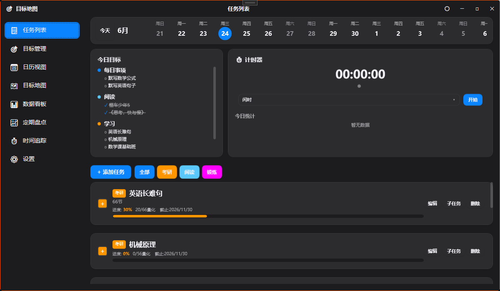
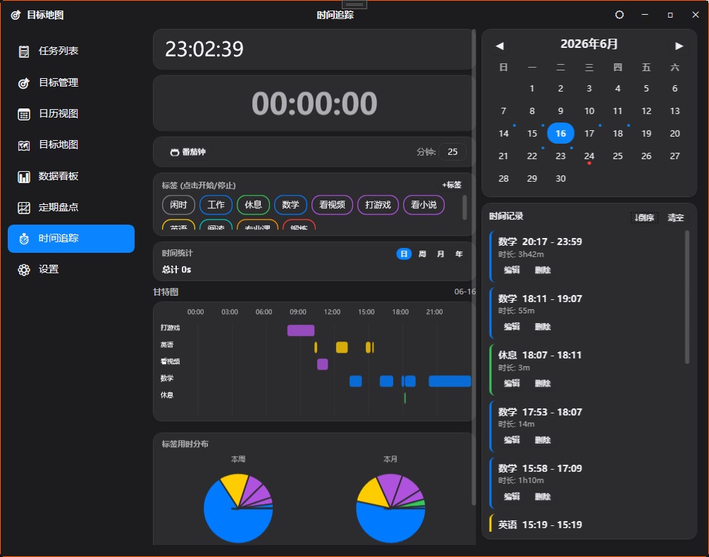
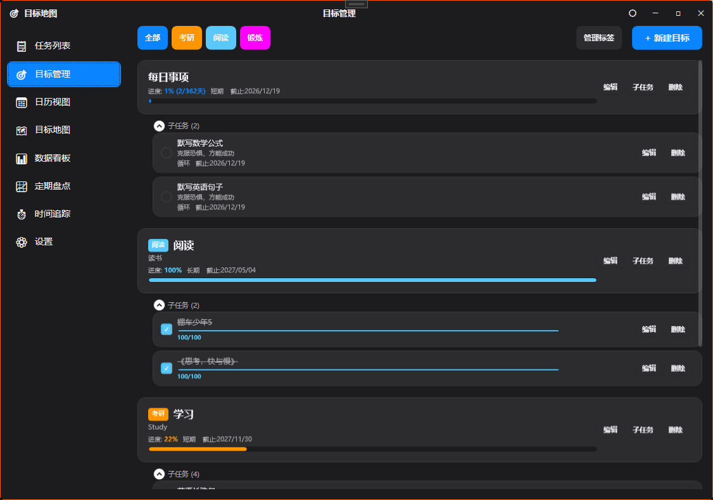
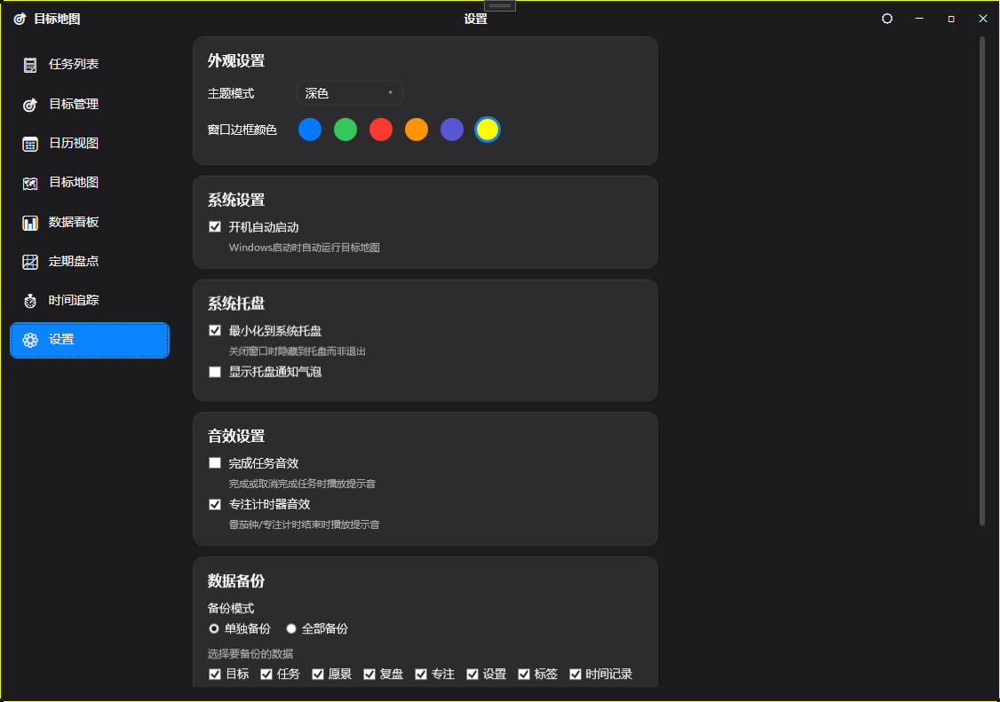

# 目标地图 (Goal Map) — 个人目标管理 & 时间追踪工具

> 一款纯本地运行的 WPF 桌面应用，帮助你规划目标、追踪时间、管理任务，保护你的隐私数据安全。

   

---

## 功能概览

| 模块 | 功能 |
|------|------|
| 📋 任务列表 | 多类型任务、日期筛选、标签过滤、进度追踪、番茄钟计时 |
| 🎯 目标管理 | 目标分类、标签系统、父子层级、自动进度计算 |
| 📅 日历视图 | 月度日历、颜色标记、详情侧栏 |
| 🗺️ 目标地图 | 树形结构可视化、进度环、全局概览 |
| 📊 数据看板 | 打卡率、剩余天数、连续打卡、任务进度条、日历热力图 |
| 📝 定期盘点 | 周/月/年统计、完成率趋势、目标进度列表 |
| ⏱️ 时间追踪 | 标签计时、甘特图、饼图分布、番茄钟、右键管理 |
| ⚙️ 设置 | 主题切换、边框颜色、开机自启、系统托盘、数据备份/导入 |

---

## 界面截图

### 任务列表

- 顶部横向日期条，左右滑动快速切换日期
- 标签过滤按钮，一键筛选不同标签的任务
- 右侧今日目标进度 + 计时器控件
- 支持周期性任务（每日/每周/自定义次数）和量化任务

### 时间追踪

- 左侧：实时时钟 + 计时器 + 番茄钟 + 标签管理 + 时间统计 + 甘特图 + 饼图
- 右侧：日历选择 + 当日记录列表（正序/倒序切换）
- 标签右键菜单：编辑/删除标签
- 甘特图点击查看详情弹窗，支持日/周/月/全部筛选

### 数据看板

- 左侧任务列表带标签过滤
- 右侧统计卡片（打卡率、剩余天数、连续打卡）
- 月度日历热力图：绿色=已完成，红色=未完成
- 任务进度条颜色跟随标签颜色

### 目标管理

- 目标卡片展示：标签颜色、进度条、子目标数量
- 支持短期/长期/灵感三种时间框架
- 量化目标支持数值追踪

### 设置

- 浅色/深色主题切换
- 5 种预设边框颜色 + 系统选色盘自定义
- 系统托盘最小化
- 全量/增量数据备份与导入

---

## 核心功能详解

### 📋 任务管理

- **多类型任务**：一次性、周期性（每日/工作日/周末/每周/每月/间隔/自定义）、量化任务
- **自定义周期**：自定义任务支持设置"每周 N 次"、"每天 M 次"的目标次数
- **日期筛选**：顶部横向日期条，支持左右滑动切换
- **标签过滤**：点击标签按钮筛选不同分类的任务
- **进度追踪**：量化任务自动计算完成百分比，周期任务显示当日完成次数
- **子任务**：支持主任务下创建子任务，层级展示

### ⏱️ 时间追踪

- **标签计时**：点击标签开始计时，再次点击停止；自动插入"闲时"记录填充空隙
- **番茄钟**：可配置工作/短休息/长休息时长，自动切换阶段
- **甘特图**：按标签分组展示当日时间分配，点击查看详情（时间范围、时长、占比、记录列表）
- **饼图分布**：本周/本月标签用时分布，点击饼块查看该标签详细记录
- **时间统计**：支持日/周/月/年四种维度，展示各标签累计用时
- **右键管理**：右键标签可编辑或删除

### 🎯 目标管理

- **目标分类**：短期目标、长期目标、灵感目标三种时间框架
- **标签系统**：自定义标签名称和颜色，便于分类管理
- **父子层级**：支持目标嵌套，子目标完成自动更新父目标进度
- **量化目标**：支持数值型目标追踪，自动计算完成百分比

### 📅 日历视图

- **月度日历**：直观展示每日任务分布
- **颜色标记**：不同目标/任务用不同颜色区分
- **详情侧栏**：点击日期查看当日任务详情

### 🗺️ 目标地图

- **树形结构**：可视化展示目标层级关系
- **进度环**：每个目标节点显示完成进度
- **全局概览**：一目了然的目标体系

### 📊 数据看板

- **打卡率**：任务完成天数 / 预期天数
- **剩余天数**：距离截止日期的天数
- **连续打卡**：连续完成任务的天数
- **任务进度条**：颜色跟随标签颜色，直观展示完成进度
- **日历热力图**：绿色=已完成，红色=未完成，蓝色=待完成

### 📝 定期盘点

- **统计维度**：周/月/年三种时间维度
- **完成率**：整体任务完成百分比
- **趋势图表**：每日完成数量折线图
- **目标进度**：各目标的完成进度列表

### ⚙️ 设置

- **主题模式**：浅色 / 深色 / 跟随系统
- **窗口边框颜色**：5 种预设颜色 + 系统选色盘自定义颜色
- **开机自启**：Windows 启动时自动运行
- **系统托盘**：最小化到托盘、托盘通知气泡
- **音效设置**：任务完成 / 专注结束提示音
- **数据备份**：单独备份或全部备份为 JSON 文件
- **数据导入**：从备份文件恢复数据

---

## 技术栈

| 类别 | 技术 |
|------|------|
| 框架 | .NET 8 WPF |
| UI 库 | ModernWpf 0.9.6（Fluent Design 控件） |
| 架构 | MVVM 模式（ViewModel + Code-Behind 混合） |
| 存储 | JSON 文件本地存储（无数据库依赖） |
| 主题 | DynamicResource 动态主题切换（浅色/深色） |
| 窗口 | 自定义 WindowChrome（无边框圆角窗口） |
| 托盘 | Windows Forms NotifyIcon |
| 选色 | Windows Forms ColorDialog |

### 项目依赖

```xml
<PackageReference Include="ModernWpfUI" Version="0.9.6" />
```

仅依赖 ModernWpfUI 一个 NuGet 包，其余均为 .NET 8 内置库。

---

## 项目结构

```
Fangan/
├── README.md                    # 项目说明
├── Fangan.slnx                  # 解决方案文件
└── ME/
    ├── ME.csproj                # 项目文件
    ├── App.xaml                 # 应用入口，主题资源加载
    ├── MainWindow.xaml(.cs)     # 主窗口（自定义标题栏、导航、托盘）
    │
    ├── Core/                    # 基础类
    │   ├── RelayCommand.cs      # 命令绑定
    │   ├── ViewModelBase.cs     # ViewModel 基类
    │   └── EventAggregator.cs   # 事件聚合器
    │
    ├── Models/                  # 数据模型
    │   ├── Goal.cs              # 目标模型
    │   ├── TaskItem.cs          # 任务模型（支持周期/量化）
    │   ├── GoalTag.cs           # 标签模型
    │   ├── TimeTag.cs           # 时间标签模型
    │   ├── TimeRecord.cs        # 时间记录模型
    │   ├── Vision.cs            # 愿景模型
    │   ├── Review.cs            # 盘点模型
    │   └── FocusSession.cs      # 专注会话模型
    │
    ├── Data/                    # 数据存储层（JSON）
    │   ├── JsonStore.cs         # JSON 序列化/反序列化
    │   ├── GoalRepository.cs    # 目标数据仓库
    │   ├── TaskRepository.cs    # 任务数据仓库
    │   ├── TagRepository.cs     # 标签数据仓库
    │   ├── TimeTagRepository.cs # 时间标签数据仓库
    │   ├── TimeRecordRepository.cs # 时间记录数据仓库
    │   ├── VisionRepository.cs  # 愿景数据仓库
    │   ├── ReviewRepository.cs  # 盘点数据仓库
    │   └── SettingsRepository.cs # 设置数据仓库
    │
    ├── Services/                # 业务逻辑服务
    │   ├── GoalService.cs       # 目标服务
    │   ├── TaskService.cs       # 任务服务（周期计算、完成判定）
    │   ├── ThemeService.cs      # 主题服务（浅色/深色切换）
    │   ├── SharedTimerService.cs # 共享计时器服务（单例）
    │   ├── FocusTimerService.cs # 专注计时器服务
    │   ├── BackupService.cs     # 备份服务
    │   └── SoundService.cs      # 音效服务
    │
    ├── ViewModels/              # MVVM ViewModel
    │   └── MainWindowViewModel.cs
    │
    ├── Views/                   # XAML 页面
    │   ├── TasksView.xaml       # 任务列表（日期条、标签过滤、计时器）
    │   ├── GoalsView.xaml       # 目标管理
    │   ├── CalendarView.xaml    # 日历视图
    │   ├── MapView.xaml         # 目标地图
    │   ├── DashboardView.xaml   # 数据看板
    │   ├── ReviewView.xaml      # 定期盘点
    │   ├── TimeTrackView.xaml   # 时间追踪（甘特图、饼图、番茄钟）
    │   ├── SettingsView.xaml    # 设置
    │   ├── CustomDatePicker.xaml # 自定义日历控件
    │   ├── ConfirmDialog.xaml   # 确认对话框
    │   ├── GoalEditDialog.xaml  # 目标编辑对话框
    │   ├── TaskEditDialog.xaml  # 任务编辑对话框
    │   ├── TagEditDialog.xaml   # 标签管理对话框
    │   ├── TagEditorDialog.xaml # 时间标签编辑对话框
    │   ├── RecordEditDialog.xaml # 时间记录编辑对话框
    │   ├── PomodoroSettingsDialog.xaml # 番茄钟设置对话框
    │   └── QuantitativeInputDialog.xaml # 量化输入对话框
    │
    └── Resources/               # 资源文件
        └── Styles.xaml          # 全局样式（DynamicResource 主题系统）
```

---

## 数据存储

数据存储在 `%LOCALAPPDATA%/ME/JsonData/` 目录下：

| 文件 | 内容 |
|------|------|
| `goals.json` | 目标数据 |
| `tasks.json` | 任务数据 |
| `tags.json` | 目标标签数据 |
| `time_tags.json` | 时间标签数据 |
| `time_records.json` | 时间记录数据 |
| `visions.json` | 愿景数据 |
| `reviews.json` | 盘点记录 |
| `focus_sessions.json` | 专注会话记录 |
| `settings.json` | 应用设置 |

---

## 安装运行

### 环境要求

- Windows 10/11
- .NET 8.0 Runtime

### 从源码构建

```bash
# 克隆项目
git clone https://github.com/nailao946/OKR.git
cd OKR

# 构建
dotnet build "ME\ME.csproj"

# 运行
dotnet run --project "ME\ME.csproj"
```

### 发布

```bash
dotnet publish "ME\ME.csproj" -c Release -r win-x64 --self-contained true -p:PublishSingleFile=true
```

---

## 设计风格

- **iOS/macOS 风格**：圆角卡片（12px）、柔和阴影、简洁布局
- **深色模式**：完整深色主题支持，所有界面元素适配
- **DynamicResource**：全局动态主题切换，即时生效
- **自定义窗口**：无边框圆角窗口，自定义标题栏（最小化/最大化/关闭）
- **主色调**：蓝色 (#007AFF)，可自定义窗口边框颜色
- **中文界面**：全中文标签和提示

---

## 任务类型说明

| 类型 | 说明 |
|------|------|
| 一次性 | 完成后标记完成，不再重复 |
| 每日 | 每天重置，持续打卡 |
| 工作日 | 周一至周五自动显示 |
| 周末 | 周六、周日自动显示 |
| 每周 | 指定星期几出现 |
| 每月 | 指定日期或月末 |
| 间隔 | 每 N 天出现一次 |
| 自定义 | 每周 N 次 / 每天 M 次 |
| 量化 | 数值型目标，支持累加/更新模式 |

---

## License

MIT
